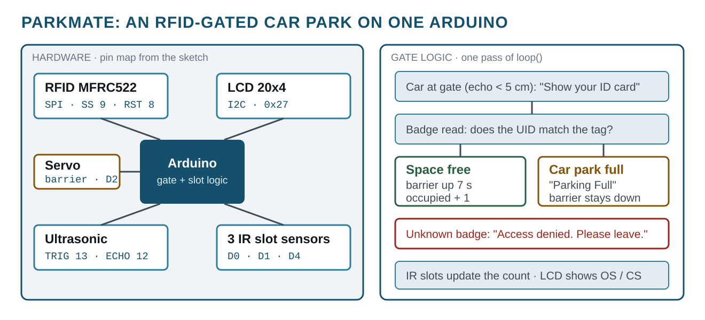
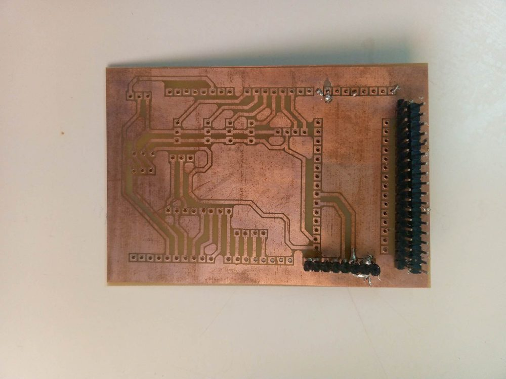
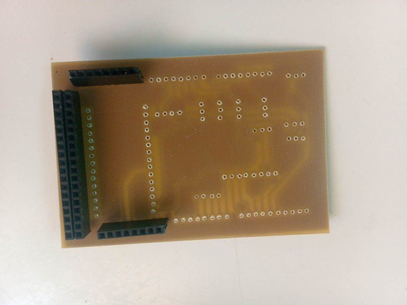

# ParkMate: RFID-Gated Smart Parking
> My first complete embedded system: badge-controlled barrier, slot sensing and a live LCD count, built in prépa for a robotics-programming innovation contest.
`2023` · `Arduino` · `MFRC522 RFID` · `SPI` · `I2C LCD` · `Servo` · `IR sensors` · `Ultrasonic` · `Proteus ARES` · `PCB etching`

## About

Built at IPEIG (Gafsa) in September and October 2023 and presented at a robotics-programming innovation contest. ParkMate manages a small car park on a single Arduino:

- an **ultrasonic sensor** notices a car at the gate and the LCD asks for a badge
- an **MFRC522 RFID reader** (SPI) checks the card against the authorised UID
- a **servo** raises the barrier for seven seconds if access is granted and a space is free, otherwise the LCD shows *Parking Full* or *Access denied*
- one **infrared sensor per slot** feeds the occupied / free count on a **20x4 I2C LCD**

## The board

Instead of leaving the prototype as jumper wires, I laid out a board in Proteus ARES, transferred it onto copper-clad and etched it myself, then fitted it with stacking headers so it plugs straight onto the Arduino.

| Etched copper side | Component side |
|---|---|
|  |  |

The Proteus ARES layout from the same presentation: [`docs/img/parkmate-layout.png`](docs/img/parkmate-layout.png).

## Pin map (MP6)

| Signal | Pin |
|---|---|
| MFRC522 SS / RST | D9 / D8 (plus the SPI bus) |
| Ultrasonic TRIG / ECHO | D13 / D12 |
| IR slot sensors 1, 2, 3 | D0, D1, D4 |
| Barrier servo | D2 |
| LCD 20x4 | I2C, address 0x27 |

## Firmware history

After a first bring-up sketch, the firmware went through seven revisions in two weeks. They are all kept, in their original Arduino folders, as the real history of the project:

| Folder | Date | What changed |
|---|---|---|
| `sketch_oct1a/` | 2023-10-01 | RFID + LCD + servo bring-up: read a badge, open the barrier |
| `parkmate/` | 2023-10-01 | First full system: PIR at the gate (D3), 4 IR slot sensors |
| `parkmate1/` | 2023-10-08 | Slot sensors now decrement the free-space count; count moved to LCD line 2 |
| `PARKMATE3/` | 2023-10-11 | PIR replaced by an ultrasonic range check (TRIG 13 / ECHO 12), 3 slots |
| `PARKMATE3_copy_20231011234713/` | 2023-10-14 | Barrier held open 7 s before closing; slot-leave handling removed |
| `PM4/` | 2023-10-14 | Counts occupied spaces against a total of 3; adds the Parking Full refusal |
| `MP6/` | 2023-10-14 | Occupied-space counter clamped with constrain(); the most complete version |
| `pm5/` | 2023-10-14 | Alternative counting on free spaces; last file saved |

## Known issues

These are left as they were written in 2023. They are the lessons of the project:

1. **Slot sensors on the serial pins.** IR sensors 1 and 2 are on D0 and D1, which are the UART that `Serial.begin(9600)` also uses. Debug output and the slot readings interfere. Move them to free pins.
2. **Counting states instead of events.** The occupied count changes on every pass of `loop()` while a sensor is covered, not once when a car arrives or leaves. It needs edge detection: remember each sensor's last state and count only changes.
3. **`servo.write(-90)`** is clamped to 0 degrees by the Servo library, so the barrier angles are really 0 and 90.
4. **One hard-coded badge UID.** A real installation needs a list of authorised cards, ideally stored in EEPROM.

## Build

Arduino IDE, any ATmega328P board with the Uno pinout. Libraries: **MFRC522**, **LiquidCrystal_I2C**, plus the bundled **Servo**, **SPI** and **Wire**. Open any folder under `firmware/` and upload.

The project presentation is in [`docs/ParkMate.pptx`](docs/ParkMate.pptx).

## Third-party work used here

Everything in this repository is my own work. It builds on the following, which are **not** mine and are used under their own licences:

- **MFRC522** Arduino library by Miguel Balboa. <https://github.com/miguelbalboa/rfid>
- **LiquidCrystal_I2C** Arduino library. <https://github.com/johnrickman/LiquidCrystal_I2C>
- **Arduino core, Servo, SPI and Wire** libraries by Arduino. <https://www.arduino.cc>

## Author

Lassaad Mahmoudi <assaadmahmoudi0@gmail.com>  
https://linkedin.com/in/mahmoudiassaad
